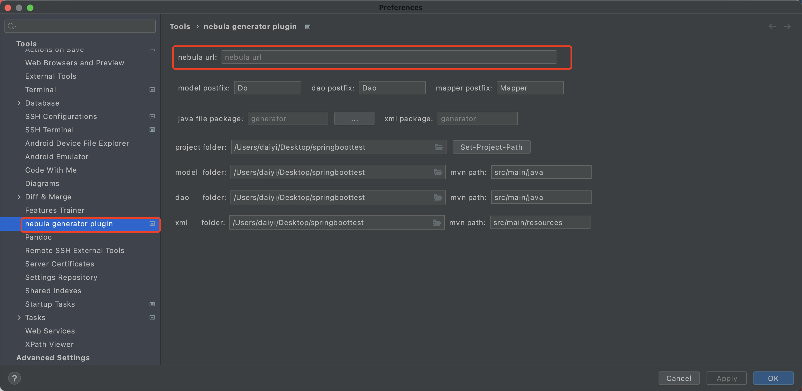
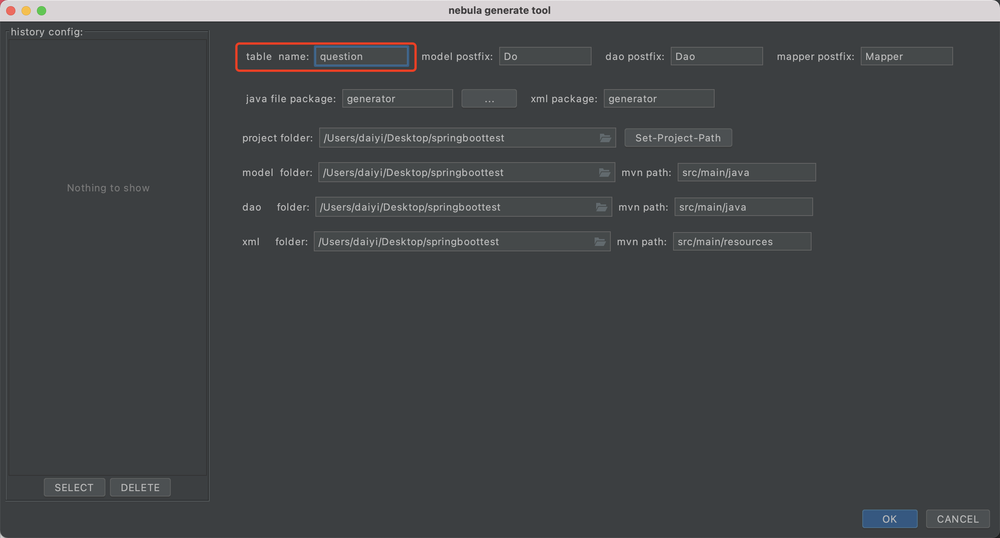
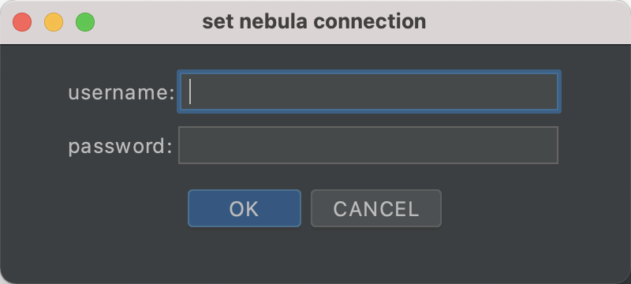
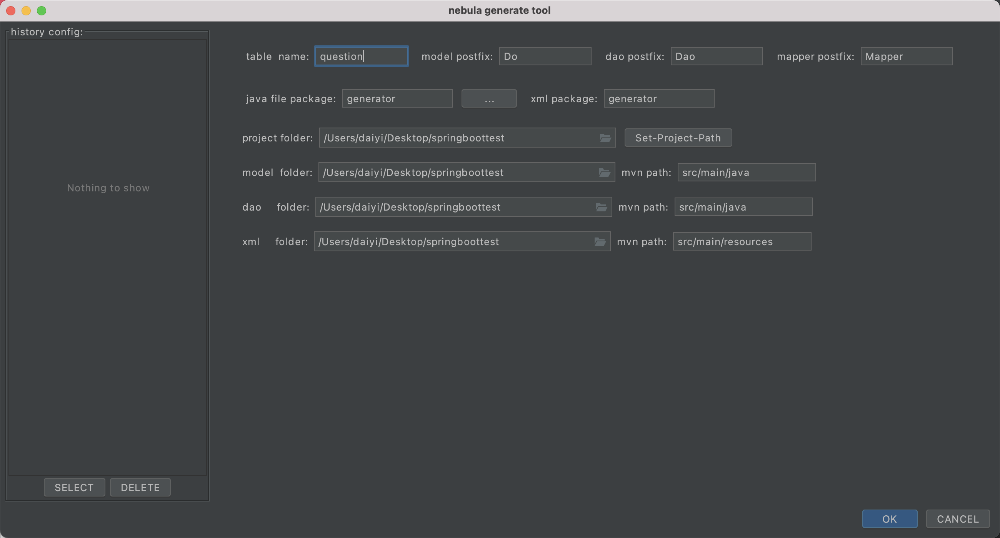
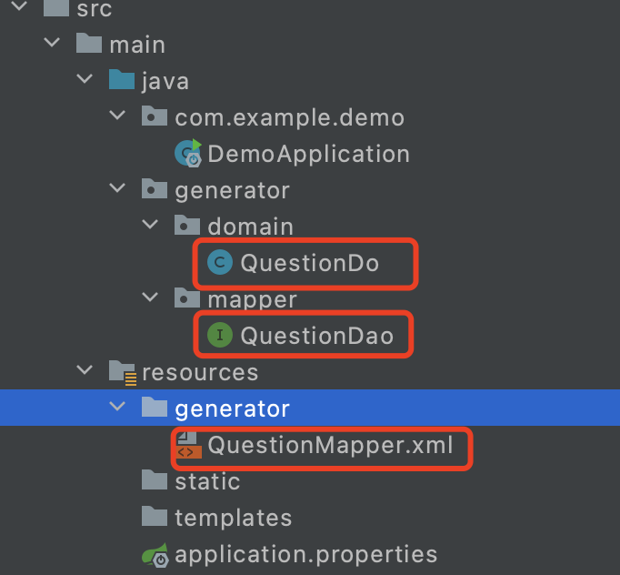
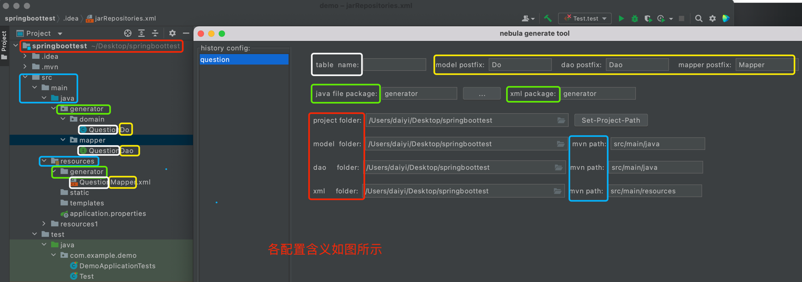

# nebula generator plugin

## 1.1 支持的情况

支持多数据库连接密码记录

支持历史生成记录

默认驼峰转换

目前仅支持NEBULA 2.5.0

## 1.2 不支持的情况

不支持do和dao生成在两个不同的目录

不支持多表同时生成

生成文件选择性覆盖

## 2.1 使用方法

1。command + ，打开设置面板，填写数据库url以及通用默认配置

（url example) jdbc:graph://%s:%s/%s?characterEncoding=utf8

2。control + optaion + command + n 打开生成面板，填写表名

3。第一次连接需要输入当前url的用户名和密码

4。首次链接成功后再需要生成打开面板，填写表名，点击ok

配置左侧为历史记录，成功生成后记录，在此需要使用点击选按SELECT

5.生成效果如图所示

6.代码生成路径为 project folder + mvn path + java package

## todo

Do not request resource from classloader using path with leading slash
https://github.com/spotbugs/spotbugs/pull/1646